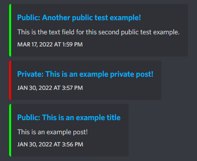

# Patreon Discord Announcer (PDA)
PDA is an application that utilizes Discord as a notification platform to inform users of new and current posts from their favorite Patreon creators. Instead of navigating to multiple Patreon pages and checking each for new or current posts, PDA allows you to view all of your Patreon content in one channel. Our Bot commands make this even more simple allowing you to add/remove content creators at any time, change where you want your posts to be displayed, or opt out entirely if you lose interest. 




## Features
* Simple and efficient output from Patreon to Discord
* Solves Patreon's Captcha to avoid bot detection
* Utilizes JDA for seamless Discord Integration
* Reads and labels both public and private posts

## How to Run
**Method 1: Invite our PDA Bot** - *Recommended, quick and simple*  
* [Add PDA to your Discord server](https://discord.com/oauth2/authorize?client_id=965002259689783296&scope=bot&permissions=68608)  
* Use [Bot Commands](#bot-commands) listed below to get updates on your favorite content creators   
    
**Method 2: Use your own bot** - *Not recommended, highly technical*  
* Download the latest [PDA release](https://github.com/cis3296s22/patreon-discord-announcer/releases)  
* Extract the downloaded zip in any directory  
* Inside the directory containing the extracted PDA files, open config.json and replace **TOKEN**'s value **0** with your Discord Bot Token.  
* If you need help finding your Discord Bot Token or with any other part of creating/setting up your Discord Bot, view our [Discord Bot Wiki](https://github.com/cis3296s22/patreon-discord-announcer/wiki/Technical-Information)  
* Once properly configured, open a terminal/console and navigate to the directory where the PDA binary is stored, from here run the command `java -jar patreon-discord-announcer-x.x-jar-with-dependencies.jar` and PDA will start running. **Ensure x.x is changed to the appropriate version number**  
* Now you can use PDA and it's bot commands from your own Discord Bot, but note that when the terminal is closed PDA will no longer update your channel.  

## Bot Commands
* Displays this list of commands in your Discord channel, can also be used to test if bot is currently online.  
  > `/help`
* Set the channel id the bot will announce posts in
  > /setchannel 920036233038671953
* Allows the user to select the creator page from patreon by copy and pasting the url after the command.  
  > /addlink https://www.patreon.com/supermega
* Allows the user to remove a channel they no longer wish to recieve notifications from.  
  > /removelink https://www.patreon.com/supermega

## Building
- **System Build Requirements**
    - Java JDK 8 or later
    - Maven 3.8.1 or later
    - Firefox 98 or later
- **Manually (IntelliJ IDEA)**
    1) Open IntelliJ and clone this repository through the program
    2) After the project is cloned and opened, at the top of IntelliJ, go to **View** -> **Tool Windows** -> **Maven**
    3) You can now build the package using Maven by going to **PDA** -> **Lifecycle** -> **package**
- **Manually (with Maven)**
    1) Clone this repository
    2) Enter the project folder in Command Prompt (Windows) or Terminal (macOS/\*nix)
    3) Use Maven to package the project by running `mvn package`
- **Automatically (with Maven)**
    ```
    git clone https://github.com/cis3296s22/patreon-discord-announcer.git
    cd patreon-discord-announcer
    mvn package
    ```

After building with Maven, you can find or run the package by going into the **target** folder.  It will be named **patreon-discord-announcer-x.x-jar-with-dependencies.jar** (replace x.x with the version number)

# Contribute
Follow this project board to know the latest status of the project: [https://github.com/cis3296s22/patreon-discord-announcer/projects/2](https://github.com/cis3296s22/patreon-discord-announcer/projects/2)
